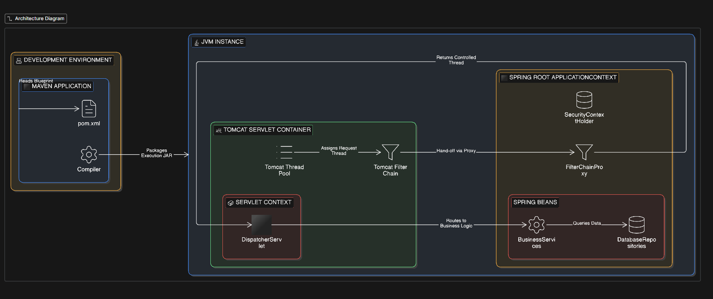

# Spring Security

## Type of attacks
- CSRF (Cross site request forgery)
- Cross site scripting
- - input validator
- SQL injection
- - Parameterized query
- - ORM frameworks
- - validate inputs

## spring security provides
- SecurityFilterChain configs (to add custom filters like jwt)
- Authentication Manager
- - Authentication providers (DaoAuthenticationProvider, OAuth2Authentication...)
- Password encoding
- UserDetails & UserDetailsService (to fetch users behind used by authentication manager)

## JWT Token
- compact string of Header+Payload+SecretKey signed with secret key by specific algorithm.
- Dependencies
- - jjwt-api
- - jjwt-impl
- - jwt-jackson

## Spring security impl flow
- WebSecurityConfig
- - CSRF disable, CSRF policy stateless, jwtFilter add, public routes for auth,
- - bean definition for PasswordEncoder, AuthenticationManager
- JwtService
- - genrateAccessToken(), getSecreteKey(), getIdFromToken()
- JwtFilter
- - get token from header, if valid set authentication with (user, authorities) in securityContextHolder if not exist already.
- UserDetails & UserDetailService impl with User (Entity) & UserService - used by authentication manager behind to get user and validate
- AuthController 
- AuthService
- - signUp - create user, signIn - validate with authentication manager and return token.

## Spring Security related Exceptions

## ?
- SecurityContextHolder
- SecurityFilter
- AuthenticationManager -> AuthenticationProvider -> 
- 

